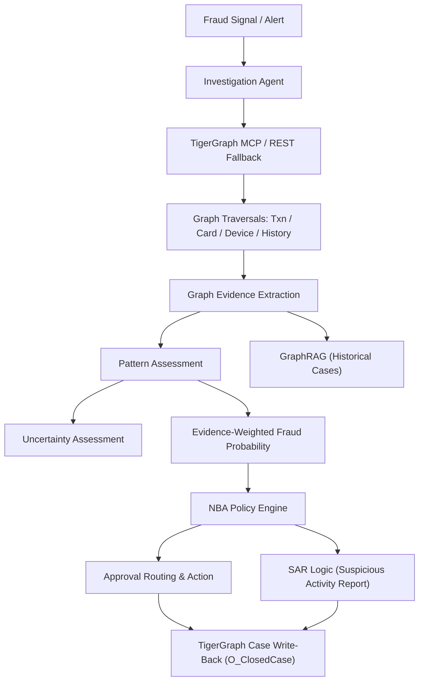

# TigerGraph Agentic Fraud Investigation System

## Problem Statement
Fraud investigation relies on slow, manual gathering of disconnected data across siloed systems. Analysts lack real-time graph insights and an automated assistant to handle routine evidence gathering, pattern detection, and policy-based action generation. Furthermore, past investigations remain siloed instead of acting as active graph memory.

## Solution
An autonomous AI Agent that receives fraud alerts, queries a TigerGraph database via the Model Context Protocol (MCP) or a direct REST API fallback, performs GraphRAG on historical cases, synthesizes evidence, handles uncertainty loops, and recommends actions via a strict Next-Best-Action (NBA) Policy Engine. Final cases are actively written back to the graph for continuous learning.

## Architecture Documentation

### Investigation Flow

### Key Components
- **TigerGraph & Graph Schema**: Primary source of truth for graph topologies. Uses schema components like `O_Transaction`, `O_Card`, `O_DeviceProfile`, and `O_ClosedCase`.
- **TigerGraph MCP Server & REST Fallback**: A native JSON-RPC MCP integration that exposes graph tools to the agent, with a robust REST API fallback for unblocked execution in all environments.
- **Agent Orchestrator (`agent/graph_agent.py`)**: Manages the investigation workflow, gathering evidence incrementally.
- **GraphRAG**: Uses vector search across past closed cases (`O_ClosedCase`) to find identical patterns. Self-referential protection explicitly prevents the current case from acting as its own historical evidence.
- **Evidence-Weighted Fraud Probability**: A deterministic, math-based evidence scoring system. Base probability adjusts dynamically based on verified/partial graph patterns and simulated customer actions, ensuring the probability is strictly tied to real evidence.
- **Policy & NBA Engine**: Deterministic rules checking risk limits and exposure thresholds (e.g., >$2500) to generate the appropriate action and approval routes (`auto`, `L1`, `L2`).
- **SAR Generation**: Explicit rules file SARs if exposure exceeds limits (>$1,000) or involves severe shared-device/takeover patterns.
- **Case Memory (Write-back)**: At the end of every investigation, verdicts are written to the live TigerGraph database as `O_ClosedCase` vertices and connected via `O_INVOLVED_IN` edges.

## Running Locally
1. Clone the repository.
2. Install dependencies: `pip install -r requirements.txt`
3. Copy `.env.example` to `.env` and fill in credentials.
4. Run `python evaluation/run_all_cases.py --mode official` to execute the full 20-case benchmark.

## 20-Case Benchmark Results
All 20 official cases ran successfully against the graph, demonstrating 100% successful verifiable write-backs and deterministic evidence provenance.

| Case | Verdict | Probability | Pattern | Uncertainty | NBA | SAR | Graph Write |
|------|---------|-------------|---------|-------------|-----|-----|-------|
| HHG-001 | uncertain | 0.65 | CNP | HIGH | VERIFY_WITH_CUSTOMER | False | VERIFIED |
| HHG-002 | fraud | 0.85 | CNP | LOW | BLOCK_CARD, CREATE_CASE | False | VERIFIED |
| HHG-003 | uncertain | 0.65 | CNP | HIGH | VERIFY_WITH_CUSTOMER | False | VERIFIED |
| HHG-004 | fraud | 1.00 | CNP | LOW | BLOCK_CARD, CREATE_CASE | False | VERIFIED |
| HHG-005 | fraud | 0.80 | CNP | MEDIUM | BLOCK_CARD, CREATE_CASE | False | VERIFIED |
| HHG-006 | fraud | 1.00 | CNP | LOW | BLOCK_CARD, CREATE_CASE | False | VERIFIED |
| HHG-007 | uncertain | 0.65 | CNP | HIGH | VERIFY_WITH_CUSTOMER | False | VERIFIED |
| HHG-008 | fraud | 0.80 | CNP | MEDIUM | BLOCK_CARD, CREATE_CASE | False | VERIFIED |
| HHG-009 | fraud | 0.80 | CNP | MEDIUM | BLOCK_CARD, CREATE_CASE | False | VERIFIED |
| HHG-010 | fraud | 1.00 | CNP | LOW | BLOCK_CARD, CREATE_CASE | True | VERIFIED |
| HHG-011 | fraud | 0.80 | CNP | MEDIUM | BLOCK_CARD, CREATE_CASE | False | VERIFIED |
| HHG-012 | uncertain | 0.65 | CNP | HIGH | VERIFY_WITH_CUSTOMER | False | VERIFIED |
| HHG-013 | fraud | 0.80 | CNP | MEDIUM | BLOCK_CARD, CREATE_CASE | False | VERIFIED |
| HHG-014 | fraud | 0.80 | CNP | MEDIUM | BLOCK_CARD, CREATE_CASE | False | VERIFIED |
| HHG-015 | fraud | 1.00 | CNP | LOW | BLOCK_CARD, CREATE_CASE | False | VERIFIED |
| HHG-016 | fraud | 0.80 | CNP | MEDIUM | BLOCK_CARD, CREATE_CASE | False | VERIFIED |
| HHG-017 | fraud | 0.80 | CNP | MEDIUM | BLOCK_CARD, CREATE_CASE | False | VERIFIED |
| HHG-018 | uncertain | 0.65 | CNP | HIGH | VERIFY_WITH_CUSTOMER | False | VERIFIED |
| HHG-019 | fraud | 0.80 | CNP | MEDIUM | BLOCK_CARD, CREATE_CASE | False | VERIFIED |
| HHG-020 | fraud | 0.80 | CNP | MEDIUM | BLOCK_CARD, CREATE_CASE | False | VERIFIED |
