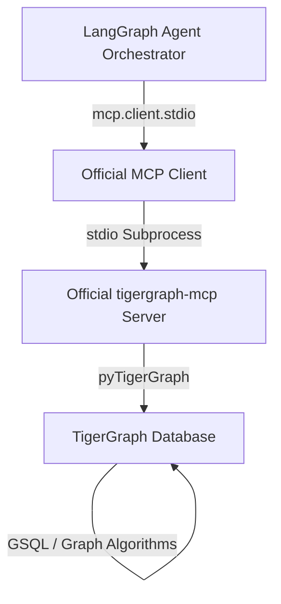

# TigerGraph MCP Architecture

This project strictly adheres to the **Model Context Protocol (MCP)** using the official `tigergraph-mcp` package. This architecture connects the AI Agent to the TigerGraph database seamlessly, exposing graph operations as standard LLM tools.

## Architecture Diagram

## How it works:
1. **Dynamic Discovery**: The LangGraph Agent boots up, spawns the `tigergraph-mcp` binary, and calls `tools/list` to discover all graph capabilities provided by the official TigerGraph package (e.g., `RunInstalledQuery`, `MapVertex`, `MapEdge`).
2. **Graph Queries**: Instead of using hand-rolled mock tools, the agent dynamically passes arguments (e.g., `txn_id`) to the `RunInstalledQuery` tool to execute `get_transaction_context` on the real database.
3. **GraphRAG**: The exact JSON topology retrieved from TigerGraph via MCP is fed into the GraphRAG Context Builder along with matched semantic policies.

## Configuration for TigerGraph Cloud / Savanna
To point the official MCP server to a live database:
1. Open `.env`
2. Set `DEMO_MODE=false`.
3. Provide the official environment variables expected by `tigergraph-mcp`:
   - `TG_HOST`
   - `TG_GRAPHNAME`
   - `TG_USERNAME`
   - `TG_PASSWORD`
   - Alternatively: `TG_API_TOKEN`
